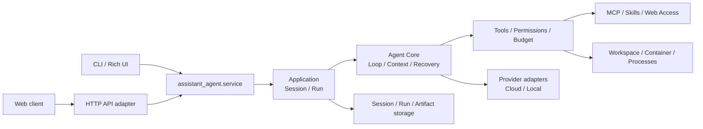

# Assistant Agent

> 本地优先、模型可切换、可嵌入 CLI 和 API 的通用任务 Agent。

Assistant Agent 面向需要让模型安全执行多步骤任务的开发者：它把模型、上下文、工具、权限、运行状态、恢复和展示适配层分开，使同一套 Agent 内核可以服务于 CLI、Web 和其他客户端。

当前是开发预览版，适合本地试用、二次开发和评测。未经安全评审，不建议直接处理生产数据或暴露到公网。

## 核心能力

- 云端 OpenAI 兼容接口、Anthropic，以及 LM Studio、Ollama、vLLM 等本地后端；
- 多轮 Agent Loop、上下文 token 预算、工具调用、结构化错误和唯一运行终态；
- 文件读取/写入、代码搜索、受管 Shell、进程管理、受控图表、文件输出和图片/文本附件；
- MCP Server 的 stdio/HTTP 接入、Skill 发现与按需加载、动态能力自省；
- workspace/container 执行边界、权限确认、暂停/取消、进程树清理、checkpoint 恢复；
- CLI 交互模式、Session/Run 持久化、任务计划、运行观测和安全轨迹；
- `web_search`/`fetch_url`、Mermaid 文本图、ChartSpecV2 受控图表和 Managed Outputs。

## 架构



核心依赖方向是 `contracts <- agent <- application <- service/cli`。`bootstrap` 是具体资源装配入口，`contracts` 保存跨进程 DTO、事件、错误和 Interaction 契约。外部 Python 调用方应依赖 `assistant_agent.service`、`assistant_agent.contracts` 和 `assistant_agent.interaction`，不要依赖 `agent/` 内部实现。

## 安装

目前提供源码安装，要求 Python 3.11+。完整平台说明见 [安装指南](docs/INSTALL.md)。

```bash
git clone https://github.com/SVflower/assistant_agent.git
cd assistant_agent
python -m venv .venv
source .venv/bin/activate                 # Windows: .venv\\Scripts\\Activate.ps1
python -m pip install --upgrade pip
python -m pip install -e ".[dev]"
```

只运行而不开发时可以使用 `python -m pip install .`。当前尚未发布 PyPI/pipx 正式发行版。

## 配置与运行

推荐使用初始化向导：

```bash
assistant-agent init
```

或复制模板：

```bash
cp config.example.yaml config.yaml
```

`config.yaml` 已被忽略，不会进入 Git。云端 API key 应通过环境变量注入；本地模型填写对应的 `api_base` 和模型名。切换模型只需修改 `active` provider，或在命令行使用 `--provider`。

```bash
assistant-agent run "读取 README.md 并总结项目结构"
assistant-agent run "总结 README.md" --quiet
assistant-agent chat
assistant-agent chat --resume <session-id>
assistant-agent sessions
assistant-agent runs
assistant-agent resume <run-id>
```

## Skills 与 MCP

Skill 是任务方法说明，MCP 是外部工具协议，两者都不是硬编码到模型适配器里的能力。

- 项目 Skill：`./skills/<name>/SKILL.md`；个人 Skill：`~/.assistant_agent/skills/<name>/SKILL.md`；
- 使用 `/skills list|install|remove|doctor` 管理 Skill；
- 使用 `/mcp list|add|test|doctor|enable|disable|trust|untrust|remove` 管理 MCP Server；
- Skill 正文按需加载，MCP 工具按权限、预算、超时、审计和恢复规则执行；
- optional MCP 离线时只产生结构化降级状态，required MCP 失败才阻止当前 Runtime；
- MCP 凭据使用环境变量，不写入仓库、Session 或模型可见日志。

## 安全与执行边界

所有内置工具和 MCP 工具统一经过参数校验、`deny -> ask -> allow` 权限策略、预算和审计。

```yaml
sandbox:
  mode: workspace       # off | workspace | container
  engine: docker        # docker | podman
  image: python:3.11-slim
  network: none
  memory: 1g
  cpus: 1.0
  pids_limit: 256
```

`workspace` 是应用层路径边界，不等于 OS 沙箱；`container` 主要隔离 Agent 内置 Shell/Git。外置 MCP Server、自定义 Python Tool、API 和 Web 进程需要由部署方单独隔离。详细安全约束见 [SECURITY.md](SECURITY.md)。

## 大数据与交付物边界

Agent 不会把百万行数据或大型 JSON 直接塞进模型上下文。工具应在数据源侧过滤、聚合、抽样或生成受管 Artifact，再把摘要和引用交给模型。`create_output` 只表达交付物元数据，Runtime 负责捕获和保存正文；API/Web 只通过受控 Artifact 引用访问文件，不接收任意服务器路径、脚本或 URL。

图表使用受控 ChartSpecV2，浏览器不执行统计计算。SPC、OEE、质量分析和企业知识库属于后续业务扩展，应通过确定性 Analysis Provider、Knowledge Provider、Skill 或 Business MCP 接入，不能把模型猜测当作工业算法结果。

## 文档导航

面向用户：[安装指南](docs/INSTALL.md)、[安全策略](SECURITY.md)、[贡献指南](CONTRIBUTING.md)。

面向开发者：[架构事实源](docs/ARCHITECTURE.md)、[公共服务集成指南](docs/agent-service-integration-guide.md)、[实现状态](docs/IMPLEMENTATION_STATUS.md)、[路线图](ROADMAP.md)、[工业 Agent 产品蓝图](docs/INDUSTRIAL_AGENT_PRODUCT_BLUEPRINT.md)。

面向维护者：`docs/m*.md` 是阶段方案，`docs/*handoff*.md` 是跨项目交接，`docs/archive/` 是历史迁移资料，`tests/` 和 `evals/` 是可复现质量资产。

M/A 文档是开发过程资产，不要求普通用户阅读，也不全部复制到 README。它们保留在仓库中用于审计设计决策和帮助贡献者定位代码；README 只维护稳定的产品入口和长期成立的边界。

## 开发与质量

```bash
pytest
pytest --cov
ruff format . && ruff check .
python -m mypy src/assistant_agent
python -m evals scripted
python -m evals recovery
```

真实 Provider 评测需要本地配置，默认不进入 CI；密钥、Session/Run、日志、输出、缓存、覆盖率和构建产物由 `.gitignore` 排除。

## License

MIT License，详见 [LICENSE](LICENSE)。
