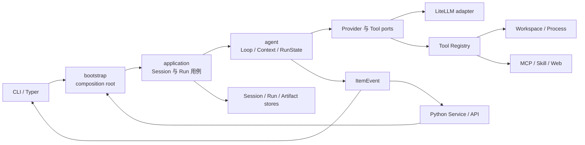

# Assistant Agent 学习手册

这套手册不是重新实现一个简化 Agent，而是带你阅读当前项目的真实代码。建议先理解调用链和状态，
再深入某个工具或集成。遇到不熟悉的 Python 语法，可以先查第 1 章。

## 推荐路线

1. [项目里会遇到的 Python](01-python-primer.md)
2. [架构与启动过程](02-architecture-and-startup.md)
3. [Agent Loop 与上下文](03-agent-loop-and-context.md)
4. [工具、权限与执行环境](04-tools-permissions-execution.md)
5. [Session、Run 与恢复](05-session-run-recovery.md)
6. [Provider、Skill、MCP 与 Web](06-integrations.md)
7. [调试方法与练习](07-debugging-and-exercises.md)

## 先记住四句话

1. **模型只负责提出文本或工具调用，程序负责校验、授权、执行和持久化。**
2. **`bootstrap` 负责组装对象，`application` 负责用例，`agent` 负责推理循环和 Run 状态。**
3. **Conversation、Session、RunState 是三种不同状态，不能互相替代。**
4. **`ItemEvent` 是内核与 CLI/API 的边界，UI 不应读取日志或猜异常文本。**

## 一张总图

箭头表示运行时调用方向，不表示所有 Python import。精确依赖规则见
[`docs/ARCHITECTURE.md`](../ARCHITECTURE.md) 和 `.importlinter`。

## 关键文件速查

| 想理解什么 | 从这里开始 | 接着看 |
|---|---|---|
| CLI 如何启动 | `src/assistant_agent/__main__.py` | `main.py`、`cli/setup.py` |
| Runtime 如何装配 | `bootstrap/runtime.py:create_runtime` | `bootstrap/tools.py` |
| API 如何调用 | `service/__init__.py` | `bootstrap/service.py`、`application/sessions.py` |
| Agent 如何循环 | `agent/loop.py:AgentLoop` | `agent/turn.py`、`agent/tool_batch.py` |
| 上下文如何管理 | `agent/context/conversation.py` | `window.py`、`compaction.py` |
| 工具如何安全执行 | `tools/registry.py:ToolRegistry.execute` | `permissions.py`、`context.py` |
| Run 如何恢复 | `agent/run/coordinator.py` | `state.py`、`persistence/run_store.py` |
| 会话如何保存 | `persistence/store.py` | `application/sessions.py` |
| MCP 如何桥接 async | `integrations/mcp/manager.py` | `transport.py`、`tool.py` |

## 阅读源码的方法

- 先找公开入口和返回类型，再进入实现，不要从目录第一份文件开始逐个看。
- 看见一个类时，先回答：它拥有哪份可变状态？谁创建它？谁关闭它？
- 看见持久化代码时，重点找锁、临时文件、`os.replace` 和失败后的清理。
- 看见工具执行时，重点核对“副作用发生前”是否已经完成参数校验、权限判断和 checkpoint。
- 测试通常比注释更能说明边界。用 `rg "类名|方法名" tests` 找调用示例。

## 术语

- **Port**：核心层需要的一种能力接口，例如“调用模型”或“保存 Session”。
- **Adapter**：Port 的具体实现，例如 LiteLLM、JSON 文件存储。
- **Composition root**：唯一负责创建并连接具体对象的地方，本项目是 `bootstrap`。
- **Runtime**：一次隔离运行所需资源的集合，包括模型、工具、进程、MCP、Store 和关闭逻辑。
- **Run**：一次用户任务的可恢复执行。
- **Checkpoint**：Run 在安全边界保存的状态快照。
- **Artifact**：受管产物，通过不透明 ID 访问，不向调用方暴露服务器路径。

